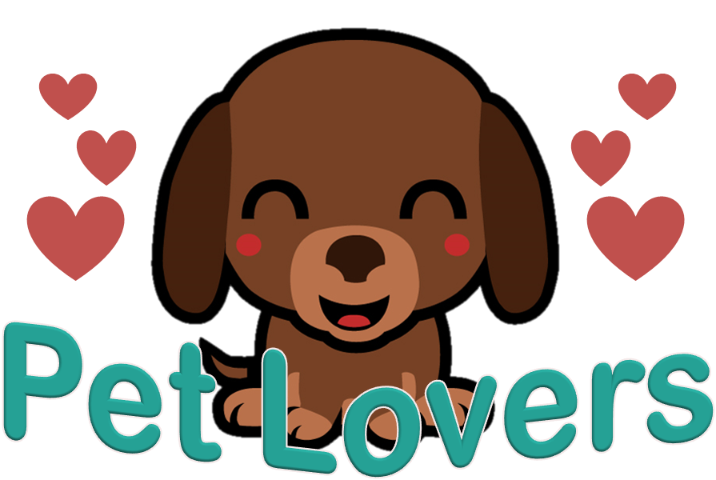
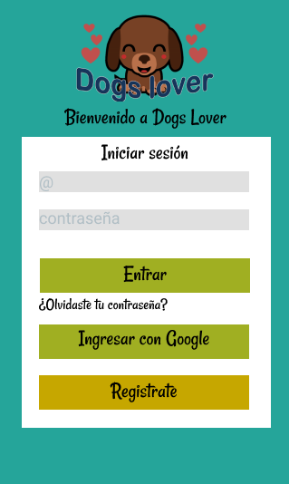
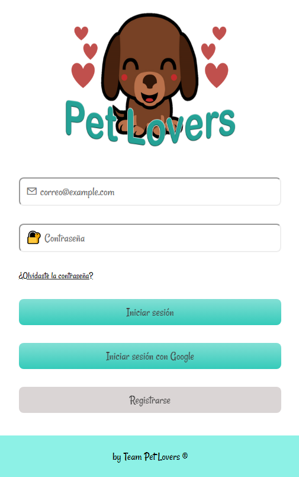

 

# **Pet Lovers** red social

## Indice
* ¡Bienvenido a Pet Lovers!
* Organización y diseño.
    * imagen primer boseto
    * Producto final
* Próximas mejoras.

 

# ¡Bienvenido a Pet Lovers!
Una red social gratuita que pretende dar a los amantes de los animales, un lugar dónde compartir sus anecdotas, presumir a sus mascotas y ponerlos en contacto con gente que comparte ese mismo amor, bajo un contexto de respeto y amistad. Puedes abrir una cuenta con tu gmail u otro correo electrónico.

En un principio sólo teníamos claro que nuestra temática serían los animales, pero las posibilidades eran demasiado amplias, por lo que mediante conversaciones con algunas personas que nos mostraron sus inquietudes respecto a criticas y comentarios desagradables que habían resivido en sus redes sociales habituales. De está manera, desidimos enfocarnos a un público amante de los animales. Al ser esta una red social especifica para amantes de animales, se convierte en un lugar amigable, donde pueden hacer amistades, compartir tips, etc. Las posibilidades son infinitas. 

 

## Organización y diseño

Como primer paso para llevar a cabo el proyecto, hicimos una planificación en [Trello](https://trello.com/b/A9HUzmeI/red-social), luego se hizo un prototipo de alta fidelidad en figma, con el que testeamos con dos posibles usuarios. 
(Puedes ver el video en el [drive de Pet Lovers](https://drive.google.com/drive/folders/1T-KpzGhfRlJOhdcX90QmoOs4_drX1Wud?usp=sharing), escuchar testeo con figma [aquí](https://soundcloud.com/ebru-atlantis/usertest-socialnetwork-audio) y el [testeo con el login](https://soundcloud.com/ebru-atlantis/whatsapp-audio-2019-06-10-at-214711))  ya terminado.

### Prototipo hecho en figma

para ver más pincha [aquí](https://www.figma.com/file/CrHIpiLofz8slH9KTTDAXC3B/Red-Social).

 

#### *Después de pedir muchas opiniones, el resultado fue este:*
### Producto final

## Próximas mejoras a la aplicación.
La aplicación pasó por varias iteraciones en su proceso de creación, y queremos que siga mejorando para dar a nuestros usuarios una red social donde puedan sentirse comodos y felices.
Seguiremos trabajando para que puedas reaccionar y comentar los post de tus amigos; y hablar con ellos por chat.